# ffa_adversarial

## Details

### Base accuracy
|                   | Forward-Forward   | Linear    | Conv  |
|-------------------|-------------------|-----------|-------|
| Forward-Forward   | 0.904             |           |       |
| Linear            |                   | 0.887     |       |
| Conv              |                   |           | 0.927 |

### MNIST Saliency Map
#### FFA
|   Digit   |   FFA             |    LinearNet     |   ConvNet |
|-----------|-------------------| -----------------|-----------|
|   0       | 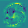 | 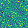 | 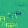 | 
|   1       | 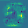 | 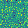 | 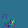 |
|   2       | 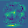 | 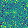 | 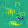 |
|   3       | 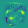 | 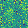 | 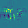 |
|   4       | 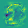 | 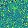 | 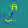 |
|   5       | 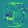 | 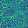 |  |
|   6       | 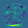 | 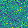 | 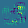 |
|   7       | 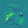 | 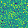 | 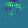 |
|   8       | 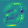 | 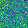 | 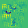 |
|   9       | 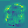 | 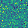 | 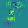 |

### FGSM perturbations
|                   | Forward-Forward   | Linear    | Conv  |
|-------------------|-------------------|-----------|-------|
| Forward-Forward   | 0.634             | 0.856     | 0.885 |
| Linear            | 0.812             | 0.017     | 0.879 |
| Conv              | 0.857             | 0.891     | 0.364 |

### PGD perturbations
|                   | Forward-Forward   | Linear    | Conv  |
|-------------------|-------------------|-----------|-------|
| Forward-Forward   | 0.452             | 0.864     | 0.894 |
| Linear            | 0.809             | 0.008     | 0.867 |
| Conv              | 0.876             | 0.891     | 0.052 |